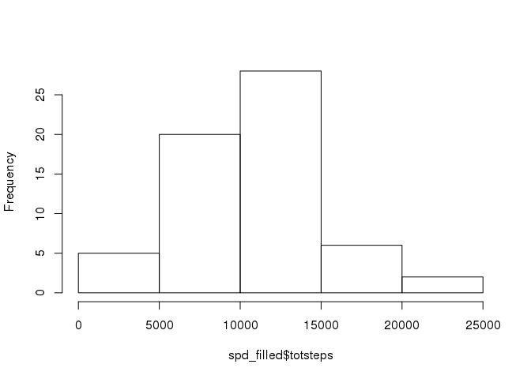

# Reproducible Research: Peer Assessment 1


## Loading and preprocessing the data

Data was supplied in zipped format from the original repo fork.  First I will
unzip it and load it into R.  Then I will turn the date into a date.


```r
unzip("activity.zip")
df = read.csv("activity.csv")

library(lubridate) # For ymd()
```

```
## 
## Attaching package: 'lubridate'
```

```
## The following object is masked from 'package:base':
## 
##     date
```

```r
df$date = ymd(as.character(df$date))
```


## What is mean total number of steps taken per day?
Per instructions, get the mean and median steps per day (ignoring NAs).

Steps:
1.  Get sum of all steps on each day


```r
library(dplyr) # For slicing/dicing convenience
```

```
## 
## Attaching package: 'dplyr'
```

```
## The following objects are masked from 'package:lubridate':
## 
##     intersect, setdiff, union
```

```
## The following objects are masked from 'package:stats':
## 
##     filter, lag
```

```
## The following objects are masked from 'package:base':
## 
##     intersect, setdiff, setequal, union
```

```r
spd = df %>% group_by(date) %>%
  summarise(totsteps=sum(steps, na.rm=TRUE))
```

2.  Produce a histogram of steps per day


```r
hist(spd$totsteps, main="", xlab="Total Steps", ylab="Frequency (# days)")
```

<!-- -->

3. The mean and median steps per day (with NAs treated as 0s)


```r
mn = mean(spd$totsteps)
mdn = median(spd$totsteps)
```
The mean is 9354.2295082 steps/day and median is 10395 steps/day.

## What is the average daily activity pattern?

1.  Produce a plot of the average (over all days) number of steps per 5-minute interval.  To do this, I make a summary table of steps per interval/number of days (as above, this calculation will be biased by missing measurements).


```r
ndays = length(spd$date)
spi = df %>% group_by(interval) %>%
  summarise(totsteps=sum(steps, na.rm=TRUE), avgsteps=sum(steps, na.rm=TRUE)/ndays)

plot(spi$interval, spi$avgsteps, type="l",
     xlab="Interval", ylab="Average steps (all days)")
```

<!-- -->

2.  To find the interval with maximum average steps:

```r
maxavgsteps = max(spi$avgsteps)
maxint = spi$interval[spi$avgsteps==maxavgsteps]
```

Interval id with max steps: 835

## Imputing missing values

1.  Get the missing number of rows with missing values

```r
miss = is.na(df$steps)
misscount = sum(miss)
```
There are 2304 intervals with NA steps.

2.  I will fill in the missing values with the average for the time interval (noting that this is a scientifically sketchy thing to do unless we understand why the values are missing).

```r
df$fillsteps = df$steps
for (i in 1:length(df$fillsteps)){
  intr = df$interval[i]
  if(is.na(df$fillsteps[i])){
    df$fillsteps[i]=spi$avgsteps[spi$interval==intr]
    } 
  else {
    df$fillsteps[i]=df$fillsteps[i] 
    }
}
df_filled = df[,c("fillsteps", "date", "interval")]
colnames(df_filled) = c("steps", "date","interval")

spd_filled = df_filled %>% group_by(date) %>%
  summarise(totsteps = sum(steps))

mn_filled = mean(spd_filled$totsteps)
mdn_filled = median(spd_filled$totsteps)

hist(spd_filled$totsteps, main="")
```

<!-- -->

Mean after filling: 1.0581014\times 10^{4}  Median after filling: 1.0395\times 10^{4}

## Are there differences in activity patterns between weekdays and weekends?


```r
library(ggplot2)
df$weekend = ifelse(weekdays(df$date) %in% c("Saturday","Sunday"), "weekend", "weekday")
df$weekend = as.factor(df$weekend)
spi_day = df %>% group_by(interval, weekend) %>%
  summarise(avgsteps = mean(steps, na.rm=TRUE))
spi_day %>% ggplot()+geom_line(aes(x=interval, y=avgsteps))+
  facet_grid(weekend~.)+theme_bw()
```

<!-- -->

Yes, there are differences between weekends and weekdays.
